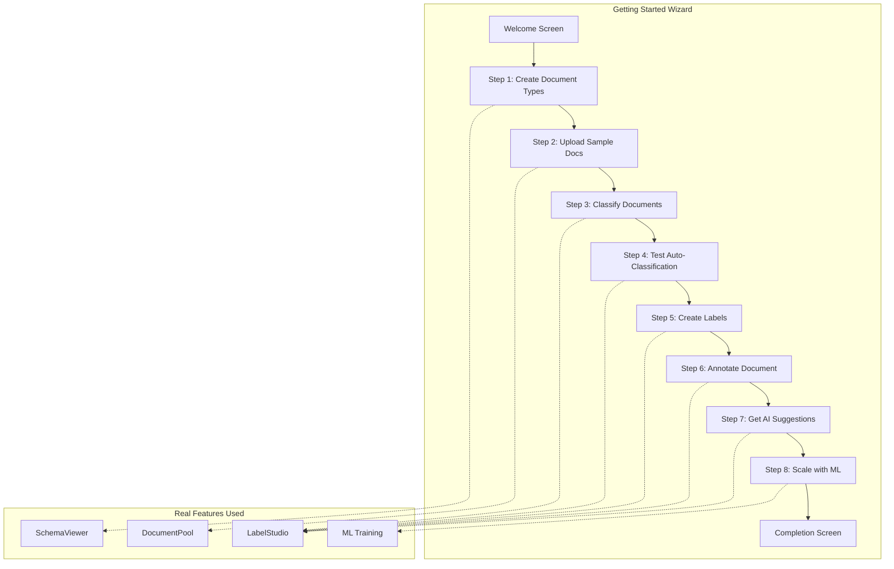

# Getting Started Wizard

## Architecture Overview




## Sample Insurance Documents

Create 6 sample PDF documents with clear distinguishing traits:


| Document                          | Type                 | Key Traits                                                                    |
| --------------------------------- | -------------------- | ----------------------------------------------------------------------------- |
| `claim_form_auto_2024.pdf`        | Insurance Claim Form | Claim number, policy number, incident date, claimant name, damage description |
| `claim_form_property_2024.pdf`    | Insurance Claim Form | Different claim type, property damage, estimated loss amount                  |
| `policy_homeowners_2024.pdf`      | Policy Document      | Policy number, coverage limits, premium amount, effective dates, insured name |
| `loss_report_theft_2024.pdf`      | Loss Report          | Incident narrative, police report number, witness statements, loss valuation  |
| `vendor_invoice_repairs_2024.pdf` | Invoice              | Invoice number, vendor name, line items, labor/parts, total amount            |
| `vendor_invoice_medical_2024.pdf` | Invoice              | Medical services invoice, different format, procedure codes                   |


## Implementation Plan

### 1. Create Sample Documents Package

**Location:** `backend/sample_docs/`

Create PDF files programmatically using ReportLab with realistic insurance content:

- Each PDF should have distinct visual layout and content patterns
- Include headers, logos placeholder, form fields, tables where appropriate
- Store as static assets that can be copied to user's data directory

**Files to create:**

- `backend/sample_docs/claim_form_auto_2024.pdf`
- `backend/sample_docs/claim_form_property_2024.pdf`
- `backend/sample_docs/policy_homeowners_2024.pdf`
- `backend/sample_docs/loss_report_theft_2024.pdf`
- `backend/sample_docs/vendor_invoice_repairs_2024.pdf`
- `backend/sample_docs/vendor_invoice_medical_2024.pdf`
- `backend/sample_docs/generate_samples.py` (script to regenerate PDFs)

### 2. Backend API for Tutorial Setup

**New endpoint in** [backend/src/uu_backend/api/routes/tutorial.py](backend/src/uu_backend/api/routes/tutorial.py)

```python
@router.post("/tutorial/setup")
async def setup_tutorial():
    """Initialize tutorial with sample documents and types."""
    # 1. Create document types: Claim Form, Policy Document, Loss Report, Invoice
    # 2. Copy sample PDFs to data directory
    # 3. Ingest sample documents
    # 4. Create default labels for insurance domain
    # Return: document IDs, type IDs, label IDs

@router.get("/tutorial/status")
async def get_tutorial_status():
    """Check if tutorial has been completed or is in progress."""
    # Track which steps are complete

@router.post("/tutorial/reset")
async def reset_tutorial():
    """Clear tutorial data and start fresh."""
```

### 3. Getting Started Wizard Component

**New file:** [frontend/client/src/components/onboarding/GettingStartedWizard.tsx](frontend/client/src/components/onboarding/GettingStartedWizard.tsx)

A stepper component with 8 steps, each embedding the real UI components:

**Step Structure:**

```typescript
interface WizardStep {
  id: string;
  title: string;
  description: string;
  objective: string;
  component: React.ReactNode; // Embedded real component
  validation: () => boolean;  // Check if step is complete
}
```

**Step Details:**

1. **Welcome** - Overview, what you'll learn, "Start Tutorial" button
2. **Create Document Types** - Embedded SchemaViewer with guidance overlay. Create: "Claim Form", "Policy Document", "Loss Report", "Invoice"
3. **Explore Sample Documents** - Show the 6 pre-uploaded documents, explain their differences
4. **Classify Your First Document** - Open claim_form_auto in LabelStudio, manually classify as "Claim Form"
5. **Test Auto-Classification** - Open policy_homeowners, click "Auto" to see AI classify it
6. **Create Annotation Labels** - Create labels: "Claim Number", "Policy Number", "Claimant Name", "Amount", "Date"
7. **Annotate a Document** - Highlight and label key fields in the claim form
8. **Get AI Suggestions** - Click "Suggest Labels" to see AI-generated suggestions
9. **Complete** - Summary, link to full workspace, tips for scaling

### 4. Getting Started Page

**New file:** [frontend/client/src/pages/GettingStarted.tsx](frontend/client/src/pages/GettingStarted.tsx)

```typescript
export function GettingStarted() {
  return (
    <Shell>
      <GettingStartedWizard
        onComplete={() => navigate('/project/tutorial')}
      />
    </Shell>
  );
}
```

### 5. Add Route and Navigation

**Update** [frontend/client/src/App.tsx](frontend/client/src/App.tsx):

- Add route: `/getting-started` → `GettingStarted`

**Update** [frontend/client/src/components/layout/Shell.tsx](frontend/client/src/components/layout/Shell.tsx):

- Add "Getting Started" link in sidebar (with special styling for new users)

**Update** [frontend/client/src/pages/Dashboard.tsx](frontend/client/src/pages/Dashboard.tsx):

- Add "Getting Started" card for first-time users
- Show completion progress if tutorial started

### 6. Progress Tracking

**State management:** Use localStorage to track:

```typescript
interface TutorialProgress {
  started: boolean;
  currentStep: number;
  completedSteps: string[];
  documentIds: string[];  // Sample docs created
  typeIds: string[];      // Document types created
  labelIds: string[];     // Labels created
}
```

## File Summary

**New Backend Files:**

- `backend/sample_docs/` - Directory with 6 PDF samples
- `backend/sample_docs/generate_samples.py` - PDF generation script
- `backend/src/uu_backend/api/routes/tutorial.py` - Tutorial API endpoints

**New Frontend Files:**

- `frontend/client/src/pages/GettingStarted.tsx` - Main page
- `frontend/client/src/components/onboarding/GettingStartedWizard.tsx` - Wizard component
- `frontend/client/src/components/onboarding/WizardStep.tsx` - Step wrapper component
- `frontend/client/src/components/onboarding/steps/` - Individual step components

**Modified Files:**

- `frontend/client/src/App.tsx` - Add route
- `frontend/client/src/components/layout/Shell.tsx` - Add nav link
- `frontend/client/src/pages/Dashboard.tsx` - Add getting started card
- `backend/src/uu_backend/api/main.py` - Register tutorial router

## User Experience Flow

1. User visits app for first time → Dashboard shows "Getting Started" card
2. Click "Start Tutorial" → Redirects to `/getting-started`
3. Wizard shows welcome screen with overview
4. Each step shows:
  - Current objective in a highlighted banner
  - Real UI component (SchemaViewer, LabelStudio, etc.)
  - "Next" button enabled when objective is met
  - Progress bar at top
5. On completion → Redirects to workspace with all sample data ready
6. Can restart tutorial anytime from Settings
