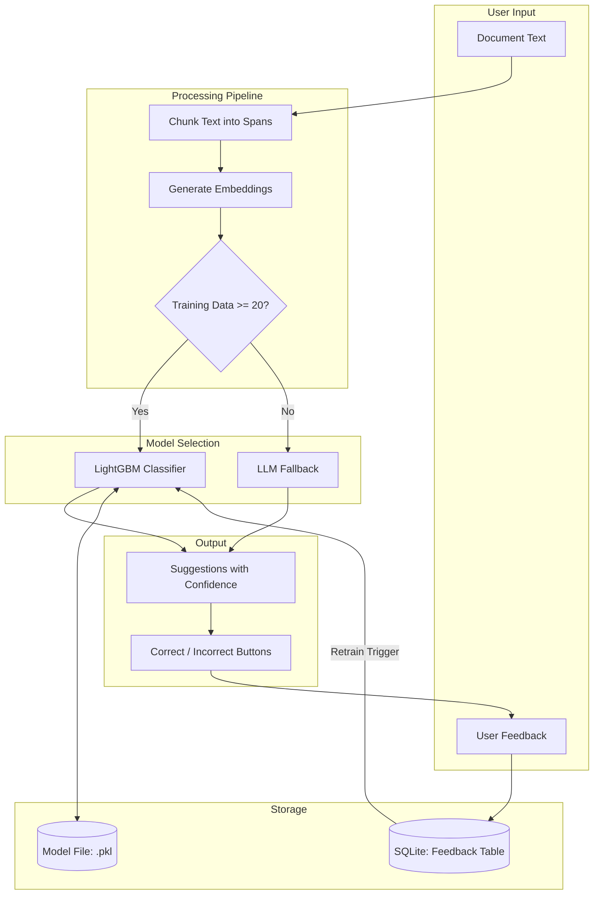

# LightGBM Label Suggestion with Reinforcement Learning

## Architecture

## Backend Changes

### 1. New Dependencies

Add to [backend/pyproject.toml](backend/pyproject.toml):

- `lightgbm` - gradient boosting classifier
- `sentence-transformers` - local embeddings (faster than OpenAI, free)
- `joblib` - model serialization

### 2. Feedback Model

Create [backend/src/uu_backend/models/feedback.py](backend/src/uu_backend/models/feedback.py):

- `Feedback` - stores suggestion + user response (correct/incorrect/accepted/rejected)
- `FeedbackCreate` - request model
- `TrainingStatus` - model training status response

### 3. SQLite Schema Extension

Update [backend/src/uu_backend/database/sqlite_client.py](backend/src/uu_backend/database/sqlite_client.py):

- Add `feedback` table: `id, document_id, label_id, text, start_offset, end_offset, embedding, is_correct, source (suggestion/manual), created_at`
- Add `model_status` table: `id, trained_at, sample_count, accuracy, model_path`
- CRUD methods for feedback

### 4. ML Service

Create [backend/src/uu_backend/services/ml_service.py](backend/src/uu_backend/services/ml_service.py):

- `MLService` class with:
  - `embed_text(text)` - generate embeddings using sentence-transformers
  - `train_model()` - train LightGBM on feedback data
  - `predict(embeddings)` - get label predictions with confidence
  - `should_use_local_model()` - check if enough training data
  - `get_training_status()` - return model stats

### 5. Update Suggestion Service

Modify [backend/src/uu_backend/services/suggestion_service.py](backend/src/uu_backend/services/suggestion_service.py):

- Check if local model is available and trained
- Use LightGBM for predictions when possible
- Fall back to LLM when:
  - Fewer than 20 training samples
  - Low confidence predictions
  - No model trained yet

### 6. New API Endpoints

Update [backend/src/uu_backend/api/routes/suggestions.py](backend/src/uu_backend/api/routes/suggestions.py):

- `POST /feedback` - submit correct/incorrect feedback
- `GET /model/status` - get training status (sample count, last trained, accuracy)
- `POST /model/train` - manually trigger retraining
- Modify existing `POST /documents/{id}/suggest` to use hybrid approach

## Frontend Changes

### 7. API Client

Update [frontend/client/src/lib/api.ts](frontend/client/src/lib/api.ts):

- Add `Feedback`, `FeedbackCreate`, `TrainingStatus` types
- Add `submitFeedback()`, `getModelStatus()`, `trainModel()` methods

### 8. Label Studio UI

Update [frontend/client/src/components/workspace/LabelStudio.tsx](frontend/client/src/components/workspace/LabelStudio.tsx):

- Change Accept/Reject to **Correct/Incorrect** buttons (training signal)
- Add "Accept as Correct" action (creates annotation + positive feedback)
- Add "Mark Incorrect" action (removes suggestion + negative feedback)
- Show model status badge (e.g., "ML Model: 85 samples, 92% accuracy")
- Show indicator when using local model vs LLM

## Training Logic

### Retrain Triggers

- Every 10 new feedback items
- Manual trigger from UI
- On startup if feedback exists but no model

### Feature Engineering

For each text span:

1. Embedding vector (384 dims from `all-MiniLM-L6-v2`)
2. Text length (normalized)
3. Position in document (start_offset / doc_length)

### Model Training

- Multi-class classification (one class per label)
- Train/validation split (80/20)
- Save model to disk (`data/models/label_classifier.pkl`)

## File Changes Summary

| File                                                       | Action                                      |
| ---------------------------------------------------------- | ------------------------------------------- |
| `backend/pyproject.toml`                                   | Add lightgbm, sentence-transformers, joblib |
| `backend/src/uu_backend/models/feedback.py`                | New - feedback models                       |
| `backend/src/uu_backend/database/sqlite_client.py`         | Add feedback/model tables + CRUD            |
| `backend/src/uu_backend/services/ml_service.py`            | New - embedding + LightGBM training         |
| `backend/src/uu_backend/services/suggestion_service.py`    | Integrate ML service                        |
| `backend/src/uu_backend/api/routes/suggestions.py`         | Add feedback + training endpoints           |
| `frontend/client/src/lib/api.ts`                           | Add feedback types + methods                |
| `frontend/client/src/components/workspace/LabelStudio.tsx` | Correct/Incorrect UI                        |

