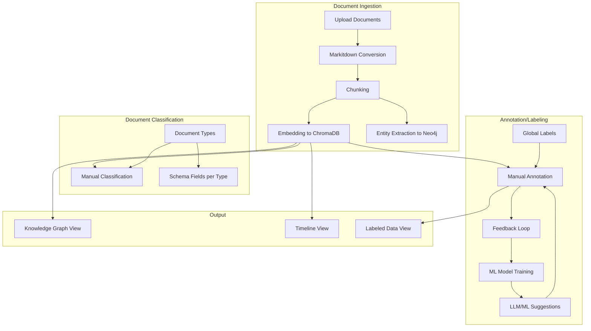
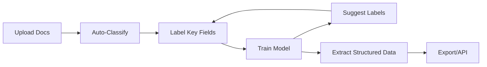
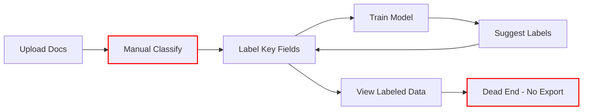

# System Gap Analysis: Unstructured Unlocked

## Current Architecture

## What Works Today (User CAN Do)

| Feature                                          | Status  | Path                               |
| ------------------------------------------------ | ------- | ---------------------------------- |
| Upload documents (PDF, DOCX, XLSX, images, etc.) | Working | Documents tab → Upload             |
| View documents (grid/list)                       | Working | Documents tab                      |
| Search documents by filename                     | Working | Documents tab search               |
| View document content (raw/markdown)             | Working | Label Studio                       |
| Create/manage labels                             | Working | Schema → Labels tab                |
| Suggest labels from documents (LLM)              | Working | Schema → Labels → Suggest          |
| Annotate text spans                              | Working | Label Studio                       |
| Get annotation suggestions (LLM/ML hybrid)       | Working | Label Studio → Suggest Labels      |
| Accept/reject suggestions (feedback)             | Working | Label Studio                       |
| Train local ML model                             | Working | Automatic after feedback threshold |
| View all annotations                             | Working | Labeled Data tab                   |
| Multi-select delete annotations                  | Working | Labeled Data tab                   |
| Define document types                            | Working | Schema → Document Types            |
| Define schema fields per doc type                | Working | Schema → Document Types → Fields   |
| Manually classify documents                      | Working | Label Studio → Classification      |
| View knowledge graph                             | Working | Knowledge Graph tab                |
| View timeline                                    | Working | Timeline tab                       |
| Manage global field library                      | Working | Fields Library page                |

## What's Missing (User CAN'T Do)

### Critical Gaps

1. **No Structured Data Extraction**
  - Labels/annotations exist but there's no way to **extract structured data** from them
  - Schema fields are defined but never actually used to extract data
  - The Extraction page (`/extraction/:id`) is a UI mockup - not connected to real logic
  - **Impact**: Can label documents but can't get structured output (JSON/CSV)
2. **No Q&A/Search Over Documents**
  - ChromaDB stores embeddings but there's no search or Q&A endpoint
  - README mentions Q&A but it's not implemented
  - **Impact**: Can't ask questions about document corpus
3. **No Auto-Classification**
  - Document types exist but classification is 100% manual
  - No LLM or ML-based automatic classification
  - **Impact**: Must manually classify every document
4. **Labels Not Connected to Document Types**
  - Labels are global (apply to all documents)
  - No way to have different labels for different document types
  - E.g., "Invoice" should have different labels than "Insurance Claim"
  - **Impact**: One-size-fits-all labeling doesn't scale
5. **No Export Functionality**
  - Can view labeled data but can't export it
  - No JSON/CSV/Excel export for annotations
  - No way to get labeled data out of the system
  - **Impact**: Labeling work is trapped in the system

### Secondary Gaps

1. **No Batch Operations**
  - Can't bulk classify documents
  - Can't bulk delete/archive
  - Can't apply labels to multiple documents
2. **No Active Learning**
  - ML model trains but doesn't suggest which documents to label next
  - No uncertainty sampling or prioritization
3. **No Extraction Validation**
  - Can't compare extracted data against ground truth
  - Evaluation tab exists but doesn't connect to real metrics

## The Intended Usage Loop vs. Reality

### Intended Flow (What Beazley Wants)

### Current Reality

## Recommended Priority Fixes

### Priority 1: Complete the Output Loop

1. **Add Export Functionality**
  - Export annotations as JSON/CSV
  - Export per-document structured data
  - API endpoint for programmatic access
2. **Implement Extraction Pipeline**
  - Use annotations + schema fields to extract structured data
  - Generate JSON output per document type

### Priority 2: Scale Classification

1. **Auto-Classification**
  - LLM-based document type classification
  - Confidence scores and manual override
2. **Per-Document-Type Labels**
  - Link labels to document types
  - Show relevant labels based on classification

### Priority 3: Enhanced Discovery

1. **Document Search/Q&A**
  - Semantic search over documents
  - RAG-based Q&A endpoint
2. **Active Learning**
  - Suggest which documents need labeling
  - Uncertainty-based prioritization

## Architecture Decision Point

Before implementation, clarify the relationship between:

- **Schema Fields** (e.g., `invoice_number`, `total_amount`) - extraction targets
- **Labels** (e.g., "Person", "Date", "Amount") - annotation categories

**Option A**: Keep them separate

- Schema fields = what to extract for a document type
- Labels = how to annotate text spans
- Need mapping: Label annotations → Schema field values

**Option B**: Unify them

- Labels ARE the schema fields
- Annotating "invoice_number" directly fills the schema
- Simpler but less flexible

