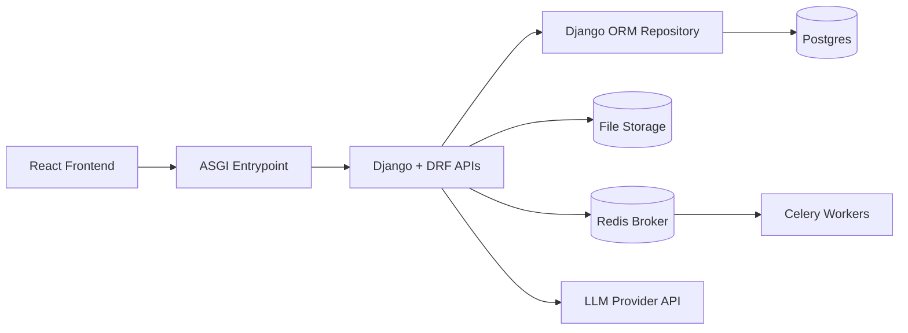
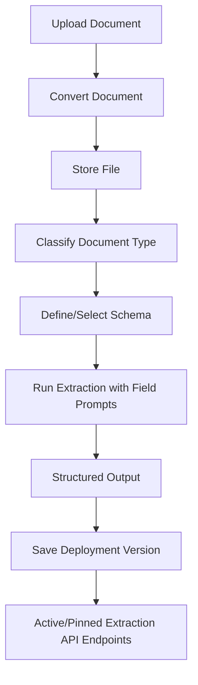

# Document Extraction Platform

A general-purpose document extraction platform that enables teams to define schemas and extract structured data from any document type using AI.

## Core Capabilities

### Schema-Driven Extraction
- Define document types and field schemas for any use case (invoices, contracts, forms, etc.)
- Use the AI Field Assistant to automatically suggest relevant fields based on sample documents
- Attach extraction prompts at the field level for precise control
- Run extraction with configurable prompts and models
- Deploy extraction configurations as versioned API endpoints

### Multi-Project Support
- Organize extraction configurations by project
- Each project can handle different document types and schemas
- Scale to multiple extraction use cases simultaneously

## Extraction Workflow

1. **Upload documents** - Ingest documents from any source
2. **Define schema** - Create document types and field definitions (use AI Field Assistant for suggestions)
3. **Classify documents** - Assign document types manually or with AI assistance
4. **Extract data** - Run structured extraction using LLM with your defined schema
5. **Deploy** - Save extraction configurations as versioned API endpoints for production use

## Architecture (Current)



- Frontend (`frontend/client`): schema builder, document management, extraction runner, deployment manager.
- Backend (`backend/src/uu_backend`): Django/DRF runtime via `uu_backend.asgi_dispatcher`.
- Persistence:
  - Postgres: schemas, classifications, extractions, versions, deployment snapshots.
  - File storage: uploaded source documents.

### Runtime Routing (Wave Status)
- All `/api/v1` route groups are served by Django/DRF.
- No legacy routing split is active.

## Data Flow



- Documents are classified by type (manual or AI-assisted)
- Extraction uses schema fields and prompts to generate structured output
- Deployment versions freeze schema + prompts for production use

## What “Save as New Version” Does

Saving a new version creates a deployable extraction snapshot for the selected project/document type:
- Captures schema + field prompts + active versions at save time.
- Stores it as a semantic version (`0.0`, `0.1`, `0.2`, ...).
- Allows activation/deactivation via Deployment UI.
- Exposes extraction endpoints that return outputs using that frozen config.

## API (Deployment)

All public APIs remain under `/api/v1`.
Runtime request ownership is served directly by Django via `uu_backend.asgi_dispatcher`.

- `POST /api/v1/deployments/versions`
  - Create a new deployment snapshot version.
- `GET /api/v1/deployments/projects/{project_id}/versions`
  - List versions for a project.
- `GET /api/v1/deployments/projects/{project_id}/active`
  - Get active version.
- `POST /api/v1/deployments/projects/{project_id}/versions/{version_id}/activate`
  - Promote a version to active.
- `POST /api/v1/deployments/projects/{project_id}/extract`
  - Extract with active version.
- `POST /api/v1/deployments/projects/{project_id}/v/{version}/extract`
  - Extract with a pinned version.

## Endpoint Dependencies

### Core Runtime Dependencies
- Backend ASGI dispatcher running (`backend`)
- Postgres available at configured `DJANGO_DATABASE_URL`
- File storage path writable for document uploads
- Chroma available for chunk/embedding retrieval
- Neo4j available for graph-backed features
- Redis + Celery worker available for background extraction tasks
- LLM credentials/config present in `.env`

### Route Group Dependency Map

| Endpoint Group | Key Routes | Depends On |
|---|---|---|
| Health | `/health`, `/api/v1/health` | Dispatcher + service checks |
| Documents/Ingestion | `/api/v1/ingest`, `/api/v1/documents*` | File storage, converter/chunker, Chroma, Postgres metadata, Celery (entity extraction) |
| Taxonomy/Schema | `/api/v1/taxonomy/*` | Postgres |
| Classification/Suggestions | `/api/v1/documents/{id}/classify`, `/api/v1/documents/{id}/suggest*` | Postgres, document content, LLM |
| Annotations | `/api/v1/documents/{id}/annotations*`, `/api/v1/annotations*` | Postgres |
| Extraction | `/api/v1/documents/{id}/extract`, `/api/v1/documents/{id}/extraction` | Postgres schema/prompts, document content, LLM |
| Evaluation | `/api/v1/evaluation*` | Postgres evaluations + annotations + schema metadata, extraction pipeline, LLM (when enabled) |
| Deployments | `/api/v1/deployments*` | Postgres deployment snapshots, extraction service, active/pinned version resolution, LLM |
| Timeline/Graph/Search | `/api/v1/timeline`, `/api/v1/graph*`, `/api/v1/search*`, `/api/v1/ask` | Chroma, Neo4j, Postgres metadata, LLM (for Q&A) |
| Tutorial Setup | `/api/v1/tutorial*` | `backend/sample_docs`, Postgres, file storage, converter/chunker |

### Deployment Endpoint-Specific Requirements
- `POST /api/v1/deployments/versions`
  - Requires valid `project_id` + `document_type_id` and existing schema fields.
- `POST /api/v1/deployments/projects/{project_id}/extract`
  - Requires an active deployment version for that project.
- `POST /api/v1/deployments/projects/{project_id}/v/{version}/extract`
  - Requires the specified saved version to exist.
- All extract endpoints require multipart file payload and a configured extraction model.

## Tech Stack

- Frontend
  - React + TypeScript
  - Vite
  - Tailwind CSS + shadcn/ui
  - Recharts
- Backend
  - Django + DRF ASGI runtime
  - Pydantic models
  - Service-layer extraction/evaluation pipelines
- Data + Infra
  - Postgres
  - ChromaDB
  - Neo4j
  - Celery + Redis (background Neo4j indexing)
  - Docker Compose
- AI/LLM
  - OpenAI-compatible API configuration via `.env` / runtime settings

## Run Locally (Docker)

The app is expected to run with Docker Compose.

```bash
docker compose build
docker compose up -d
```

Frontend: `http://localhost:3000`  
Backend API: `http://localhost:8000`

## Environment

Use your `.env` file. Important keys include:
- `OPENAI_API_KEY`
- model defaults/settings used by extraction/evaluation
- storage paths and runtime config

## Repo Layout

- `backend/` dispatcher runtime, Django + DRF APIs, extraction services, persistence
- `frontend/` React app (schema builder, document management, extraction UI, deployment manager)
- `docs/` implementation notes and guides
- `data/` local runtime storage

## Notes

- Tutorial sample PDFs in `backend/sample_docs/` are example documents demonstrating the platform's capabilities
- The platform is domain-agnostic and works with any document type
- Use projects to organize different extraction use cases
