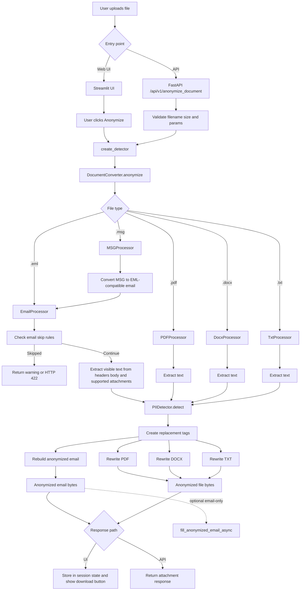

# Document Anonymizer

PII detection and anonymization for documents and emails using Azure OpenAI.

## Quick Start


### Start FastAPI Server
REST API for document anonymization and email synthetic data generation:
```bash
uv run uvicorn src/api:app --reload
```

### Launch Streamlit UI
Interactive web interface for document anonymization:
```bash
uv run streamlit run src/streamlit.py
```

## How It Works

### Current Processing Model

The application has two user-facing entry points:

- **Streamlit UI** for interactive uploads
- **FastAPI** for programmatic uploads

Both paths converge on `DocumentConverter`, which routes the uploaded file to the correct processor based on file type.

> In the Streamlit UI, uploading a file does **not** immediately anonymize it. Processing starts only when the user clicks **Anonymize**.

### Interactive Upload Flow



### PII Detection Pipeline

The detector uses a multi-step pipeline to produce consistent anonymization tags:

1. **Regex extraction** - Fast extraction of emails, phone numbers, URLs, SSNs, and other structured values
2. **LLM detection** - Azure OpenAI identifies names, companies, addresses, and context-dependent PII
3. **Merging and deduplication** - Regex and LLM detections are consolidated
4. **Profile linking** - Related names and emails are grouped so person-related tags stay consistent
5. **Second-pass review** - A second LLM pass checks the partially anonymized text for missed entities

> **Current tag format** uses short placeholders such as `<p_1>`, `<p_1_em>`, `<cn_1>`, and `<ph_1>`.

**Input Example:**
```
From: John Smith <john.smith@example.com>
Subject: Meeting Request

Hi, please call me at 555-123-4567.
```

**Anonymized Output:**
```
From: Sender <synthetic-sender@example.com>
Subject: <cn_1> Request

Hi, please call me at <ph_1>.
```

### Optional Stage 2: Synthetic Data

Synthetic data generation is available for **anonymized email files only** (`.eml` and `.msg`). It replaces tags with realistic values while preserving name/email linkage.

**Synthetic Output:**
```
From: Sender <synthetic-sender@example.com>
Subject: Acme Corp Request

Hi, please call me at 555-789-0123.
```

### Supported File Types

**Top-level uploads:**
- `.eml` - Standard email format
- `.msg` - Microsoft Outlook format
- `.pdf` - PDF documents
- `.docx` - Microsoft Word documents
- `.txt` - Plain text files

**Supported email attachment anonymization:**
- `.pdf` - Text-based PDFs (single scanned PDFs with no text may trigger a skip)
- `.docx` - Microsoft Word documents
- `.txt` - Plain text files

**Synthetic data fill:**
- `.eml`
- `.msg`

> `.msg` files are converted internally into an EML-compatible message representation before anonymization.

**Email-specific skip conditions:**
The email processor will **not process** emails containing:
1. A single scanned PDF attachment (no extractable text)
2. Excel or CSV files (`.xls`, `.xlsx`, `.xlsm`, `.xlsb`, `.csv`)
3. More than 5 attachments
4. A DOCX attachment with form fields or fill-in-the-blank template content

When skipped, the API returns HTTP 422 with the skip reason.

### What Gets Anonymized

**Email Headers:**
- From, To, CC, BCC addresses → Synthetic values
- Subject line → PII replaced with tags
- Other headers preserved

**Email Body:**
- HTML and plain text content
- Images removed
- Hyperlinks removed (text preserved)

**Attachments:**
- Text content in supported PDF, DOCX, and TXT attachments
- Filenames randomized (e.g., `report.pdf` → `a1b2c3d4e5f6.pdf`)
- Images within PDFs removed

## Components

- **API** (`src/api.py`) - FastAPI endpoints for document anonymization and email synthetic fill
- **Streamlit App** (`src/streamlit.py`) - Interactive upload UI
- **Document Router** (`src/processors/converter.py`) - Routes uploaded files to the correct processor
- **PII Detector** (`src/anonymizer.py`) - Regex + LLM-based detection and tag generation
- **Email Processor** (`src/processors/email_processor.py`) - Handles email headers, bodies, and supported attachments
- **Standalone Processors** (`src/processors/`) - PDF, DOCX, TXT, and MSG handling
- **Evaluation Pipeline** (`pipelines/eval/pipeline.py`) - Benchmarks PII extraction quality
- **Blob Batch Pipeline** (`pipelines/blob_pipeline.py`) - Processes submitted emails from Azure Blob Storage

## API Endpoints

- `GET /` - Health check and endpoint listing
- `POST /api/v1/anonymize_document` - Primary document anonymization endpoint
- `POST /api/v1/anonymize_email` - Deprecated email-only anonymization endpoint
- `POST /api/v1/fill_anonymized_email` - Fill anonymized email files with synthetic data

## Configuration Notes

- Azure OpenAI model/deployment settings are configurable via application settings.
- The README intentionally avoids hard-coding a single deployment name because the configured deployment can vary by environment.

## Testing

### Run Tests
```bash
# Run all tests
uv run pytest

# Run unit tests only
uv run pytest tests/unit/ -v

# Run integration tests only
uv run pytest tests/integration/ -v
```

## License
This project is licensed under the GNU Affero General Public License v3.0 (AGPL-3.0).

AGPL-3.0 Compliance Requirements

If you distribute or deploy this software (including as a network service), you must:

Provide Source Code Access: Make the complete source code (including all modifications) available to users
Preserve License Notices: Keep all copyright notices, license statements, and disclaimers intact
Share Modifications: Any modifications or derivative works must also be licensed under AGPL-3.0
Network Use Disclosure: If you run a modified version on a server accessible to users over a network, you must make the modified source code available to those users
Document Changes: Clearly document what changes were made and when
Key principle: The AGPL's "network copyleft" provision ensures that users who interact with the software over a network have the same rights to the source code as those who receive it directly.

These actions would trigger additional compliance obligations or incompatibility:

❌ Combining with proprietary/closed-source code: Cannot integrate this code into proprietary software without making the entire combined work AGPL-3.0
❌ Hosting without source code access: Cannot deploy as a web service/API without providing source code to users
❌ Removing license notices: Cannot strip out copyright notices or license information
❌ Re-licensing under incompatible licenses: Cannot change to licenses like MIT, Apache 2.0, or proprietary licenses
❌ SaaS without disclosure: Cannot offer this as a service (SaaS) while keeping modifications private
❌ Mixing with GPL-2.0-only code: AGPL-3.0 is not compatible with GPL-2.0-only (GPL-3.0+ is compatible)
❌ Commercial use without compliance: You can use commercially, but must still provide source code to all users
What You CAN Do
✅ Use the software for any purpose (personal, commercial, internal)
✅ Modify the code for your own use
✅ Distribute the software to others
✅ Charge for the software or services
✅ Use it internally without disclosing source code (if not deployed as a network service accessible to external users)
Important Note
If you're offering this application as an interactive service over a network (web app, API, etc.), the AGPL requires you to provide a prominent way for users to access the source code. This is the key difference from the standard GPL.

For the full license text, see the LICENSE file in this repository.

For questions about licensing or compliance, consult with a legal professional familiar with open source licenses.
