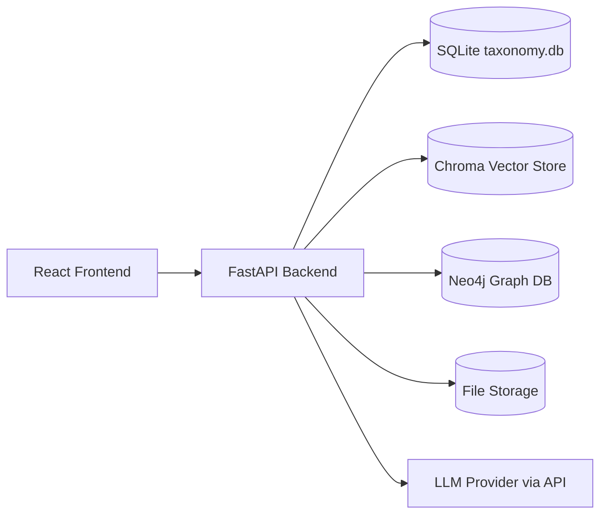
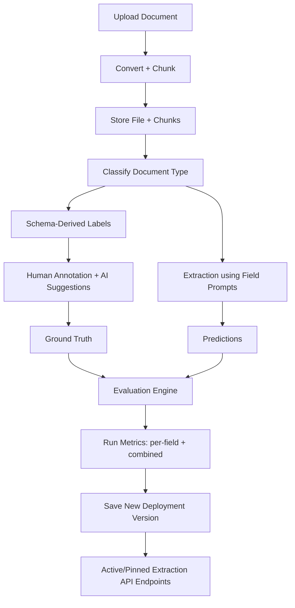

# Unstructured Unlocked

Unstructured Unlocked is a document extraction workbench focused on two outcomes:

1. Agentic schema-driven extraction: users define document types and field schemas, then run extraction that returns key-value outputs aligned to those fields.
2. Human-in-the-loop evaluation: teams label ground truth (with AI assistance), run evaluations, and track extraction quality over time.

## Core Product Goals

### 1) Agentic schema-driven extraction
- Define document types and field schemas per use case.
- Attach extraction prompts at the field level.
- Keep labels schema-derived (labels are not managed independently).
- Run extraction with prompt/model/field-version controls.
- Deploy extraction configurations as versioned API endpoints.

### 2) Evaluation with AI-assisted labeling
- Create annotations manually with AI suggestions to speed up throughput.
- Run evaluation across all labeled project documents.
- Track per-field and combined metrics (accuracy, recall, F1, completeness).
- Compare field prompt versions and measure impact by version.
- Use run history to decide when to promote a deployment version.

## Current Workflow

1. Upload documents.
2. Create/select a document type schema.
3. Add fields (manually or via AI field assistant).
4. Classify document types (manual + LLM).
5. Annotate documents with schema-derived labels.
6. Run extraction and inspect raw output.
7. Run evaluation across labeled docs.
8. Save a new deployment version and promote active version.

## Architecture (Current)



- Frontend (`frontend/client`): schema builder, labeling UI, extraction runner, evaluation board, deployment manager.
- Backend (`backend/src/uu_backend`): phased FastAPI-to-Django API migration via ASGI dispatcher, plus ingestion/classification/suggestions/extraction/evaluation/deployments.
- Persistence:
  - SQLite: schemas, labels, annotations, evaluations, versions, deployment snapshots.
  - Chroma: chunk embeddings and semantic retrieval.
  - Neo4j: entity/relationship graph features.
  - File storage: uploaded source documents.

## Data Flow (Current)



- Labels are generated from schema fields.
- Evaluation compares extraction output vs. labeled ground truth.
- Deployment versions freeze schema + prompts + field prompt versions.

## What “Save as New Version” Does

Saving a new version creates a deployable extraction snapshot for the selected project/document type:
- Captures schema + field prompts + active versions at save time.
- Stores it as a semantic version (`0.0`, `0.1`, `0.2`, ...).
- Allows activation/deactivation via Deployment UI.
- Exposes extraction endpoints that return outputs using that frozen config.

## API (Deployment)

All routes are served by FastAPI under `/api/v1`.
Migration note: the backend now runs through a composite ASGI dispatcher (`uu_backend.asgi_dispatcher`) and can route selected endpoint groups to Django using `DJANGO_MIGRATED_GROUPS`.

- `POST /api/v1/deployments/versions`
  - Create a new deployment snapshot version.
- `GET /api/v1/deployments/projects/{project_id}/versions`
  - List versions for a project.
- `GET /api/v1/deployments/projects/{project_id}/active`
  - Get active version.
- `POST /api/v1/deployments/projects/{project_id}/versions/{version_id}/activate`
  - Promote a version to active.
- `POST /api/v1/deployments/projects/{project_id}/extract`
  - Extract with active version.
- `POST /api/v1/deployments/projects/{project_id}/v/{version}/extract`
  - Extract with a pinned version.

## Endpoint Dependencies

### Core Runtime Dependencies
- FastAPI backend running (`backend`)
- SQLite available at configured `SQLITE_DATABASE_PATH`
- File storage path writable for document uploads
- Chroma available for chunk/embedding retrieval
- Neo4j available for graph-backed features
- LLM credentials/config present in `.env`

### Route Group Dependency Map

| Endpoint Group | Key Routes | Depends On |
|---|---|---|
| Health | `/docs`, `/api/v1/health` | FastAPI process, service checks |
| Documents/Ingestion | `/api/v1/ingest`, `/api/v1/documents*` | File storage, converter/chunker, Chroma, SQLite metadata |
| Taxonomy/Schema | `/api/v1/document-types*`, `/api/v1/labels*`, `/api/v1/fields*` | SQLite |
| Classification/Suggestions | `/api/v1/documents/{id}/classify`, `/api/v1/documents/{id}/suggest*` | SQLite, document content, LLM |
| Annotations | `/api/v1/documents/{id}/annotations*`, `/api/v1/annotations*` | SQLite |
| Extraction | `/api/v1/extraction*` and workspace extraction actions | SQLite schema/prompts, document content, LLM |
| Evaluation | `/api/v1/evaluation*` | SQLite evaluations + annotations + schema metadata, extraction pipeline, LLM (when enabled) |
| Deployments | `/api/v1/deployments*` | SQLite deployment snapshots, extraction service, active/pinned version resolution, LLM |
| Timeline/Graph/Search | `/api/v1/timeline`, `/api/v1/graph*`, `/api/v1/search*`, `/api/v1/ask` | Chroma, Neo4j, SQLite metadata, LLM (for Q&A) |
| Tutorial Setup | `/api/v1/tutorial*` | `backend/sample_docs`, SQLite, file storage, converter/chunker |

### Deployment Endpoint-Specific Requirements
- `POST /api/v1/deployments/versions`
  - Requires valid `project_id` + `document_type_id` and existing schema fields.
- `POST /api/v1/deployments/projects/{project_id}/extract`
  - Requires an active deployment version for that project.
- `POST /api/v1/deployments/projects/{project_id}/v/{version}/extract`
  - Requires the specified saved version to exist.
- All extract endpoints require multipart file payload and a configured extraction model.

## Tech Stack

- Frontend
  - React + TypeScript
  - Vite
  - Tailwind CSS + shadcn/ui
  - Recharts
- Backend
  - FastAPI (Python)
  - Pydantic models
  - Service-layer extraction/evaluation pipelines
- Data + Infra
  - SQLite (`taxonomy.db`)
  - ChromaDB
  - Neo4j
  - Docker Compose
- AI/LLM
  - OpenAI-compatible API configuration via `.env` / runtime settings

## Run Locally (Docker)

The app is expected to run with Docker Compose.

```bash
docker compose build
docker compose up -d
```

Frontend: `http://localhost:3000`  
Backend API: `http://localhost:8000`

## Environment

Use your `.env` file. Important keys include:
- `OPENAI_API_KEY`
- model defaults/settings used by extraction/evaluation
- storage paths and runtime config

## Repo Layout

- `backend/` FastAPI, extraction, evaluation, persistence
- `frontend/` React app (schema, labeling, eval, deployment UI)
- `docs/` implementation notes and guides
- `data/` local runtime storage

## Notes

- Tutorial sample PDFs in `backend/sample_docs/` are required by tutorial setup and should remain.
- Labels are generated from schema fields by design.
- Evaluations are intended to be run over all labeled docs in the selected project/document type.
