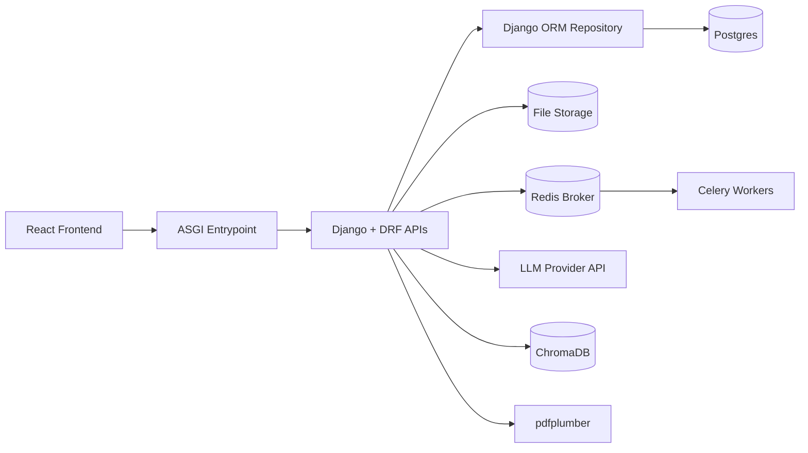
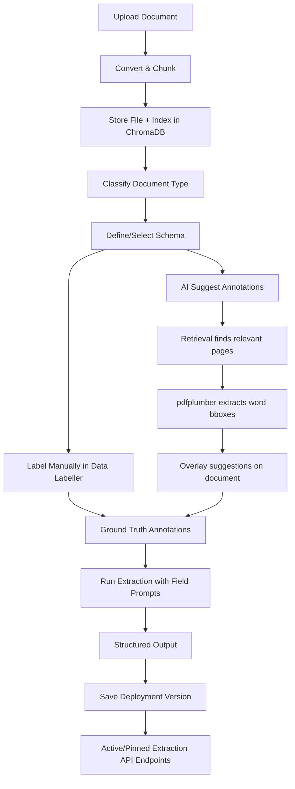

# Document Extraction Platform

[](https://github.com/YOUR_USERNAME/data-labeller/actions/workflows/backend-ci.yml)
[](https://github.com/YOUR_USERNAME/data-labeller/actions/workflows/frontend-ci.yml)
[](https://github.com/YOUR_USERNAME/data-labeller/actions/workflows/docker-publish.yml)
[](https://github.com/YOUR_USERNAME/data-labeller/actions/workflows/codeql.yml)
[](https://opensource.org/licenses/MIT)

A general-purpose document extraction and data labelling platform that enables teams to define schemas, label documents, and extract structured data from any document type using AI.

## Core Capabilities

### Schema-Driven Extraction
- Define document types and field schemas for any use case (invoices, contracts, forms, financial filings, etc.)
- Use the AI Field Assistant to automatically suggest relevant fields based on sample documents
- Attach extraction prompts at the field level for precise control
- Run extraction with configurable prompts and models — including contextual retrieval and retrieval-vision modes for complex multi-page documents
- Deploy extraction configurations as versioned API endpoints

### Data Labeller
- Dark-themed labelling UI with a three-panel layout (document list, viewer, output panel)
- **PDF annotation**: renders raw PDF with text layer selection — highlight text directly on the rendered page to create annotations
- **Image annotation**: bounding box drawing for image documents
- **AI Suggest**: generates annotation suggestions using the same contextual retrieval-vision pipeline as extraction — finds the right pages via semantic search, uses pdfplumber to get bounding box positions on those pages, and overlays suggestions directly on the document
- Approve or reject individual AI suggestions inline
- Output panel displays current annotations as JSON

### Multi-Project Support
- Organize extraction configurations by project
- Each project can handle different document types and schemas
- Scale to multiple extraction use cases simultaneously

## Extraction Workflow

1. **Upload documents** - Ingest documents from any source
2. **Define schema** - Create document types and field definitions (use AI Field Assistant for suggestions)
3. **Classify documents** - Assign document types manually or with AI assistance
4. **Label data** - Use the Data Labeller to manually annotate documents or use AI Suggest to generate and approve annotations
5. **Extract data** - Run structured extraction using LLM with your defined schema (standard, contextual retrieval, or retrieval-vision)
6. **Deploy** - Save extraction configurations as versioned API endpoints for production use

## Architecture (Current)



- Frontend (`frontend/client`): schema builder, document management, data labeller, extraction runner, deployment manager.
- Backend (`backend/src/uu_backend`): Django/DRF runtime via `uu_backend.asgi_dispatcher`.
- Persistence:
  - Postgres: schemas, classifications, extractions, annotations, versions, deployment snapshots.
  - File storage: uploaded source documents.
  - ChromaDB: contextual retrieval index (chunks + embeddings for per-field semantic search).
- pdfplumber: bounding box extraction for text PDFs and AI suggestion positioning.

### Runtime Routing (Wave Status)
- All `/api/v1` route groups are served by Django/DRF.
- No legacy routing split is active.

## Data Flow



- Documents are classified by type (manual or AI-assisted)
- Annotations can be created manually (text selection on PDFs, bounding boxes on images) or via AI Suggest
- AI Suggest uses contextual retrieval to find which pages contain the data, runs pdfplumber on those pages for bounding box coordinates, and overlays results on the document
- Extraction uses schema fields and prompts to generate structured output; supports standard vision, contextual retrieval, and retrieval-vision modes
- Deployment versions freeze schema + prompts for production use

## What “Save as New Version” Does

Saving a new version creates a deployable extraction snapshot for the selected project/document type:
- Captures schema + field prompts + active versions at save time.
- Stores it as a semantic version (`0.0`, `0.1`, `0.2`, ...).
- Allows activation/deactivation via Deployment UI.
- Exposes extraction endpoints that return outputs using that frozen config.

## API (Deployment)

All public APIs remain under `/api/v1`.
Runtime request ownership is served directly by Django via `uu_backend.asgi_dispatcher`.

- `POST /api/v1/deployments/versions`
  - Create a new deployment snapshot version.
- `GET /api/v1/deployments/projects/{project_id}/versions`
  - List versions for a project.
- `GET /api/v1/deployments/projects/{project_id}/active`
  - Get active version.
- `POST /api/v1/deployments/projects/{project_id}/versions/{version_id}/activate`
  - Promote a version to active.
- `POST /api/v1/deployments/projects/{project_id}/extract`
  - Extract with active version.
- `POST /api/v1/deployments/projects/{project_id}/v/{version}/extract`
  - Extract with a pinned version.

## Endpoint Dependencies

### Core Runtime Dependencies
- Backend ASGI dispatcher running (`backend`)
- Postgres available at configured `DJANGO_DATABASE_URL`
- File storage path writable for document uploads
- ChromaDB available for contextual retrieval (chunk/embedding index)
- Redis + Celery worker available for background indexing tasks
- LLM credentials/config present in `.env`

### Route Group Dependency Map

| Endpoint Group | Key Routes | Depends On |
|---|---|---|
| Health | `/health`, `/api/v1/health` | Dispatcher + service checks |
| Documents/Ingestion | `/api/v1/ingest`, `/api/v1/documents*` | File storage, converter/chunker, ChromaDB, Postgres metadata, Celery |
| Taxonomy/Schema | `/api/v1/taxonomy/*` | Postgres |
| Classification/Suggestions | `/api/v1/documents/{id}/classify`, `/api/v1/documents/{id}/suggest*` | Postgres, document content, LLM |
| Annotations | `/api/v1/documents/{id}/ground-truth*`, `/api/v1/annotations*` | Postgres |
| AI Annotation Suggestions | `/api/v1/documents/{id}/suggest-annotations` | Postgres, ChromaDB (retrieval), pdfplumber (PDF word boxes), LLM (extraction) |
| Extraction | `/api/v1/documents/{id}/extract`, `/api/v1/documents/{id}/extraction` | Postgres schema/prompts, document content, LLM, ChromaDB (retrieval modes) |
| Evaluation | `/api/v1/evaluation*` | Postgres evaluations + annotations + schema metadata, extraction pipeline, LLM (when enabled) |
| Deployments | `/api/v1/deployments*` | Postgres deployment snapshots, extraction service, active/pinned version resolution, LLM |
| Timeline/Graph/Search | `/api/v1/timeline`, `/api/v1/graph*`, `/api/v1/search*`, `/api/v1/ask` | ChromaDB, Postgres metadata, LLM (for Q&A) |

### Deployment Endpoint-Specific Requirements
- `POST /api/v1/deployments/versions`
  - Requires valid `project_id` + `document_type_id` and existing schema fields.
- `POST /api/v1/deployments/projects/{project_id}/extract`
  - Requires an active deployment version for that project.
- `POST /api/v1/deployments/projects/{project_id}/v/{version}/extract`
  - Requires the specified saved version to exist.
- All extract endpoints require multipart file payload and a configured extraction model.

## Tech Stack

- Frontend
  - React 19 + TypeScript
  - Vite
  - Tailwind CSS + shadcn/ui (Radix UI)
  - react-pdf / PDF.js (PDF rendering with text layer selection)
  - TanStack Query, Framer Motion, Lucide React
- Backend
  - Django + DRF ASGI runtime
  - Pydantic models
  - Service-layer extraction/evaluation/annotation pipelines
  - `pypdf` for PDF page extraction
- Data + Infra
  - Postgres (schemas, annotations, extractions, deployments)
  - ChromaDB (contextual retrieval index)
  - Celery + Redis (background indexing tasks)
  - Docker Compose
- AI/LLM
  - OpenAI-compatible API (structured output, vision)
  - pdfplumber (text PDF word-level box extraction for annotation overlay)
  - Cohere (optional reranking for retrieval)

## Run Locally (Docker)

The app is expected to run with Docker Compose.

```bash
# First time setup: Install pre-commit hooks
pip install pre-commit
pre-commit install
pre-commit install --hook-type pre-push

# Build and start services
docker compose build
docker compose up -d
```

Frontend: `http://localhost:3000`  
Backend API: `http://localhost:8000`

**Note**: Pre-commit hooks will automatically run tests and checks before commits and pushes. See [docs/PRE_COMMIT_SETUP.md](docs/PRE_COMMIT_SETUP.md) for details.

## Environment

Use your `.env` file. Important keys include:
- `OPENAI_API_KEY` — LLM for extraction, classification, and AI suggestions
- `OPENAI_MODEL` — primary model used across extraction, classification, and retrieval enrichment
- `AZURE_OPENAI_*` — optional Azure OpenAI endpoint/key/version if using Azure-hosted models
- `CO_API_KEY` / `CO_RERANK_ENDPOINT` — optional Cohere reranking for contextual retrieval
- `DJANGO_DATABASE_URL` — Postgres connection string
- `CELERY_BROKER_URL` / `CELERY_RESULT_BACKEND` — Redis URLs for background tasks

## Repo Layout

- `backend/` dispatcher runtime, Django + DRF APIs, extraction services, persistence
- `frontend/` React app (schema builder, document management, extraction UI, deployment manager)
- `docs/` implementation notes and guides
- `data/` local runtime storage

## Notes

- The platform is domain-agnostic and works with any document type
- Use projects to organize different extraction use cases
- **AI Suggest** requires the document to be indexed for contextual retrieval (ChromaDB); it automatically identifies which pages contain the relevant data before running pdfplumber bounding box analysis
- **Extraction modes**: standard (full-doc vision), contextual retrieval (per-field semantic search + text context), retrieval-vision (semantic search to find pages, then vision on rendered page images) — the labeller's AI Suggest uses retrieval-vision
