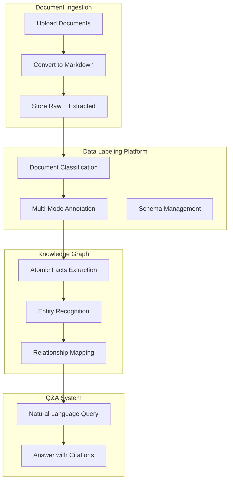
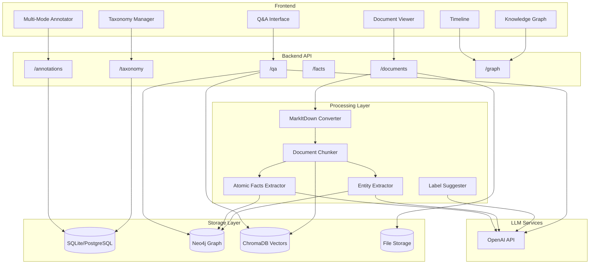
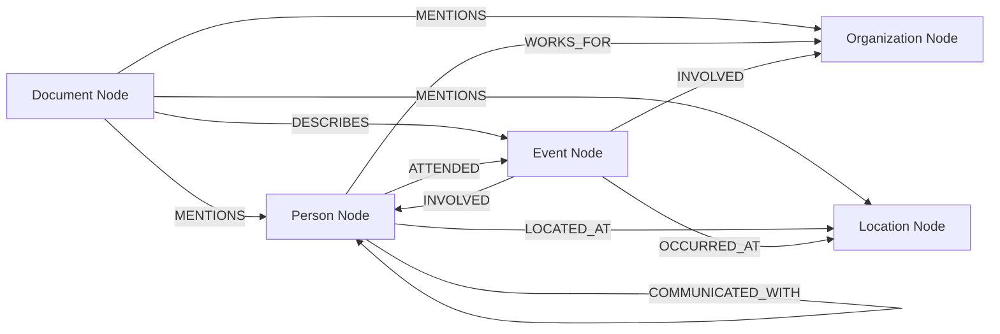

# Unstructured Unlocked

> **Transform unstructured documents into an interactive, temporal knowledge graph**

Unstructured Unlocked is a document intelligence system that ingests unstructured documents, extracts temporal and relational data, and visualizes them in an interactive timeline with powerful Q&A capabilities. Built specifically for analyzing complex document collections like the Epstein files, it enables researchers to explore "what happened when" and "who was involved" through natural language queries.

## 🎯 Project Purpose

This project focuses on two core goals:

1. **Agentic schema-driven extraction**  
   Allow users to define reusable fields and schemas for different document types, then run assisted extraction workflows that produce structured key-value pairs.

2. **Human-in-the-loop evaluation**  
   Provide an evaluation framework where extraction accuracy is measured against manually labeled ground truth, with AI-assisted labeling to speed up annotation.

In short: define schemas, extract structured outputs, evaluate quality, and iterate quickly.

## 🗺️ Implementation Roadmap

For the concrete build plan aligned to these goals, see:

- [Roadmap: Agentic Extraction + Human-in-the-Loop Evaluation](./docs/ROADMAP_AGENTIC_EXTRACTION_EVAL.md)

## 🎯 Vision

Unstructured Unlocked is a **two-component platform** for document intelligence:

### Component 1: Data Labeling Platform

Build training datasets from your documents with powerful annotation tools:

- **Document Taxonomy**: User-definable document types (Application Form, Claim, Earnings Report, etc.)
- **Multi-Mode Annotation**: Text spans, bounding boxes, and key-value extraction
- **Schema Management**: Define extraction schemas with field types and prompts
- **LLM-Assisted Labeling**: AI suggestions that improve over time based on user corrections
- **Side-by-Side View**: Raw document alongside extracted markdown for accurate labeling

### Component 2: Knowledge Graph Q&A

Transform documents into queryable knowledge:

- **Atomic Facts Extraction**: Document metadata, structured facts, and subject-predicate-object triplets
- **Entity Recognition**: Automatically identify people, organizations, locations, and events
- **Relationship Mapping**: Discover and visualize connections between entities
- **Natural Language Q&A**: Ask questions and get answers with source citations
- **Timeline Visualization**: Plot documents temporally and explore "what happened when"

### Data Flow



## ✨ Features

### 📥 Document Ingestion
- **Multi-format support**: PDF, DOCX, XLSX, images (with OCR), emails, and more
- **Bulk processing**: Ingest hundreds of documents at once
- **Metadata extraction**: Automatically extract dates, participants, and key entities
- **Incremental updates**: Add new documents without reprocessing existing ones

### 📊 Timeline Visualization
- **Interactive 2D timeline**: X-axis shows dates, Y-axis shows documents per day
- **Click to explore**: Select any document to view its content and metadata
- **Smart highlighting**: Documents referenced in Q&A responses are highlighted
- **Date filtering**: Zoom into specific time periods

### 💬 Q&A System
- **Natural language queries**: Ask questions like "What occurred on April 25, 2014?"
- **Source attribution**: Every answer links back to source documents
- **Visual feedback**: Referenced documents highlight in the timeline
- **Context-aware**: Uses RAG (Retrieval Augmented Generation) for accurate responses

### 🕸️ Knowledge Graph
- **Entity extraction**: Automatically identify people, organizations, locations, and events
- **Relationship mapping**: Discover connections between entities
- **Graph exploration**: Visualize the network of relationships
- **Document linking**: Every entity links back to source documents

## 🎯 Platform Goals

### Use Case 1: Data Labeling for Model Training

Create high-quality training datasets from your document collections:

| Capability | Description |
|------------|-------------|
| **Side-by-Side View** | Raw document displayed alongside extracted markdown for accurate comparison |
| **User Labeling** | Annotate documents to create ground truth for ML models |
| **Taxonomy Creation** | Define and manage document type classifications |
| **Schema Definition** | Create extraction schemas with field types and validation |
| **Export** | Export labeled data in formats suitable for ML training (JSON, CSV, COCO) |

### Use Case 2: Knowledge Graph Exploration

Build and query a knowledge graph from your documents:

| Capability | Description |
|------------|-------------|
| **Document Ingestion** | Bulk upload documents for automatic processing |
| **Atomic Facts** | Extract granular facts: metadata, structured claims, SPO triplets |
| **Entity Network** | Visualize relationships between people, organizations, events |
| **Natural Language Q&A** | Ask questions like "Who communicated with Person X in 2014?" |
| **Source Attribution** | Every answer links back to source documents with citations |

## 🏗️ Architecture



## 🛠️ Technology Stack

### Backend (Python)
- **[MarkItDown](https://github.com/microsoft/markitdown)** - Microsoft's document conversion tool for PDF, Office docs, images
- **[FastAPI](https://fastapi.tiangolo.com/)** - Modern, fast web framework for building APIs
- **[OpenAI API](https://platform.openai.com/)** - GPT-4 for Q&A and entity extraction
- **[Neo4j](https://neo4j.com/)** - Graph database for storing entities and relationships
- **[LangChain](https://python.langchain.com/)** - Framework for building LLM applications and RAG pipelines
- **[ChromaDB](https://www.trychroma.com/)** - Vector database for document embeddings and semantic search
- **[spaCy](https://spacy.io/)** - NLP library for date extraction and text processing

### Frontend (JavaScript)
- **[React](https://react.dev/)** - UI framework for building interactive interfaces
- **[D3.js](https://d3js.org/)** - Data visualization library for timeline rendering
- **[Cytoscape.js](https://js.cytoscape.org/)** - Graph visualization for knowledge graph exploration
- **[Axios](https://axios-http.com/)** - HTTP client for API communication
- **[TailwindCSS](https://tailwindcss.com/)** - Utility-first CSS framework

### Infrastructure
- **[Docker](https://www.docker.com/)** - Containerization platform
- **[Docker Compose](https://docs.docker.com/compose/)** - Multi-container orchestration
- **Neo4j Docker Image** - Official Neo4j container
- **Python 3.11+** - Backend runtime environment

## 🚀 Getting Started

### Prerequisites

1. **Docker & Docker Compose** installed on your system
2. **OpenAI API Key** - Get one at [platform.openai.com](https://platform.openai.com/)
3. **Git** - For cloning the repository

### Installation

1. **Clone the repository**
   ```bash
   git clone https://github.com/yourusername/unstructured-unlocked.git
   cd unstructured-unlocked
   ```

2. **Set up environment variables**
   ```bash
   cp .env.example .env
   ```
   
   Edit `.env` and add your configuration:
   ```env
   # OpenAI Configuration
   OPENAI_API_KEY=your_openai_api_key_here
   OPENAI_MODEL=gpt-5-mini
   
   # Neo4j Configuration
   NEO4J_URI=bolt://neo4j:7687
   NEO4J_USER=neo4j
   NEO4J_PASSWORD=your_secure_password_here
   
   # Vector Database
   VECTOR_DB_PATH=./data/vectordb
   CHROMA_PERSIST_DIRECTORY=./data/chroma
   
   # API Configuration
   API_HOST=0.0.0.0
   API_PORT=8000
   
   # Frontend Configuration
   REACT_APP_API_URL=http://localhost:8000
   ```

3. **Start the application**
   ```bash
   docker-compose up -d
   ```
   
   This will start:
   - Backend API (http://localhost:8000)
   - Frontend UI (http://localhost:3000)
   - Neo4j Browser (http://localhost:7474)
   - Neo4j Database (bolt://localhost:7687)

4. **Verify installation**
   ```bash
   curl http://localhost:8000/health
   ```

### First-Time Setup

1. **Access the Neo4j Browser** at http://localhost:7474
   - Username: `neo4j`
   - Password: (from your `.env` file)

2. **Initialize the database schema** (automatic on first run)

3. **Access the application** at http://localhost:3000

## 📖 Usage Guide

### Ingesting Documents

#### Via Web Interface
1. Navigate to the "Ingest" tab
2. Click "Upload Documents" or drag-and-drop files
3. Select multiple files (PDF, DOCX, XLSX, images)
4. Click "Process" to start ingestion
5. Monitor progress in real-time

#### Via API
```bash
curl -X POST http://localhost:8000/api/v1/ingest \
  -F "files=@document1.pdf" \
  -F "files=@document2.docx" \
  -F "files=@email.eml"
```

#### Via Python Script
```python
import requests

files = [
    ('files', open('document1.pdf', 'rb')),
    ('files', open('document2.docx', 'rb'))
]

response = requests.post(
    'http://localhost:8000/api/v1/ingest',
    files=files
)

print(response.json())
```

### Asking Questions

#### Example Queries

**Temporal Questions:**
```
"What occurred on April 25, 2014 in Epstein's email correspondence?"
```

**Relationship Questions:**
```
"Who was the conversation between?"
"What was their relationship?"
"How many times did Person A communicate with Person B?"
```

**Entity Questions:**
```
"What organizations are mentioned in documents from 2014?"
"List all locations mentioned in the correspondence"
```

**Contextual Questions:**
```
"What events led up to the meeting on June 15, 2013?"
"Summarize all communications about [topic] in 2014"
```

#### Using the Q&A Interface

1. Navigate to the "Q&A" tab
2. Type your question in natural language
3. Click "Ask" or press Enter
4. View the answer with:
   - **Response text** with citations
   - **Source documents** highlighted in timeline
   - **Confidence scores** for each source
   - **Related entities** from the knowledge graph

### Exploring the Timeline

1. **Navigate**: Click and drag to pan, scroll to zoom
2. **Filter**: Use date range picker to focus on specific periods
3. **Inspect**: Click any document to view:
   - Full content
   - Extracted metadata
   - Related entities
   - Connected documents
4. **Highlight**: Documents referenced in Q&A appear highlighted

### Viewing the Knowledge Graph

1. Navigate to the "Graph" tab
2. **Explore entities**: Click nodes to see details
3. **Follow relationships**: Click edges to see relationship types
4. **Filter**: Show/hide entity types (People, Organizations, Events)
5. **Search**: Find specific entities by name
6. **Expand**: Double-click to expand connected nodes

## 📊 Data Model

### Neo4j Schema



#### Node Types

**Document**
```
Properties:
- id: UUID
- filename: string
- file_type: string
- date_extracted: datetime
- date_created: datetime
- content_hash: string
- chunk_count: integer
```

**Person**
```
Properties:
- id: UUID
- name: string
- aliases: list[string]
- first_mentioned: datetime
- mention_count: integer
```

**Organization**
```
Properties:
- id: UUID
- name: string
- type: string
- first_mentioned: datetime
```

**Location**
```
Properties:
- id: UUID
- name: string
- coordinates: point (optional)
- type: string (city, country, address)
```

**Event**
```
Properties:
- id: UUID
- name: string
- date: datetime
- description: string
- event_type: string
```

#### Relationship Types

- `MENTIONS` - Document mentions an entity
- `COMMUNICATED_WITH` - Person sent/received communication
- `WORKS_FOR` - Person employed by organization
- `ATTENDED` - Person attended event
- `OCCURRED_AT` - Event happened at location
- `INVOLVED` - Entity involved in event
- `LOCATED_AT` - Entity located at place

### Vector Database Structure

```python
{
    "document_id": "uuid",
    "chunk_id": "uuid",
    "chunk_index": 0,
    "content": "text content of chunk",
    "embedding": [0.123, 0.456, ...],  # 1536 dimensions for OpenAI
    "metadata": {
        "filename": "document.pdf",
        "date": "2014-04-25",
        "page": 1,
        "entities": ["Person A", "Organization B"]
    }
}
```

## 🔌 API Endpoints

### Document Ingestion

#### `POST /api/v1/ingest`
Upload and process documents.

**Request:**
```bash
curl -X POST http://localhost:8000/api/v1/ingest \
  -F "files=@document.pdf"
```

**Response:**
```json
{
  "status": "success",
  "documents_processed": 1,
  "chunks_created": 45,
  "entities_extracted": 12,
  "processing_time_seconds": 23.5,
  "document_ids": ["uuid-1234"]
}
```

#### `GET /api/v1/ingest/status/{job_id}`
Check ingestion job status.

**Response:**
```json
{
  "job_id": "job-5678",
  "status": "processing",
  "progress": 0.65,
  "documents_completed": 13,
  "documents_total": 20
}
```

### Query & Q&A

#### `POST /api/v1/query`
Ask questions about the document corpus.

**Request:**
```json
{
  "question": "What occurred on April 25, 2014?",
  "max_results": 5,
  "date_filter": {
    "start": "2014-04-01",
    "end": "2014-04-30"
  }
}
```

**Response:**
```json
{
  "answer": "On April 25, 2014, there was email correspondence between...",
  "sources": [
    {
      "document_id": "uuid-1234",
      "filename": "email_2014_04_25.pdf",
      "relevance_score": 0.95,
      "excerpt": "...",
      "date": "2014-04-25"
    }
  ],
  "entities_mentioned": [
    {"name": "Person A", "type": "Person", "id": "uuid-5678"},
    {"name": "Organization B", "type": "Organization", "id": "uuid-9012"}
  ],
  "confidence": 0.92
}
```

### Timeline Data

#### `GET /api/v1/timeline`
Retrieve timeline data for visualization.

**Query Parameters:**
- `start_date`: ISO date (optional)
- `end_date`: ISO date (optional)
- `aggregation`: "day" | "week" | "month" (default: "day")

**Response:**
```json
{
  "timeline": [
    {
      "date": "2014-04-25",
      "document_count": 5,
      "documents": [
        {
          "id": "uuid-1234",
          "filename": "email.pdf",
          "title": "Email correspondence",
          "entities": ["Person A", "Person B"]
        }
      ]
    }
  ],
  "date_range": {
    "earliest": "2013-01-15",
    "latest": "2015-12-30"
  },
  "total_documents": 342
}
```

### Knowledge Graph

#### `GET /api/v1/graph`
Retrieve knowledge graph data.

**Query Parameters:**
- `entity_types`: Comma-separated list (optional)
- `max_depth`: Integer (default: 2)
- `center_entity`: Entity ID (optional)

**Response:**
```json
{
  "nodes": [
    {
      "id": "uuid-1234",
      "type": "Person",
      "label": "Person A",
      "properties": {
        "mention_count": 45,
        "first_mentioned": "2013-02-15"
      }
    }
  ],
  "edges": [
    {
      "source": "uuid-1234",
      "target": "uuid-5678",
      "type": "COMMUNICATED_WITH",
      "properties": {
        "frequency": 23,
        "first_contact": "2013-03-01",
        "last_contact": "2015-11-20"
      }
    }
  ]
}
```

#### `GET /api/v1/graph/entity/{entity_id}`
Get detailed information about a specific entity.

**Response:**
```json
{
  "entity": {
    "id": "uuid-1234",
    "type": "Person",
    "name": "Person A",
    "aliases": ["Alias 1", "Alias 2"],
    "mention_count": 45
  },
  "related_documents": [
    {
      "id": "uuid-doc-1",
      "filename": "document.pdf",
      "date": "2014-04-25",
      "relationship": "MENTIONS"
    }
  ],
  "relationships": [
    {
      "target_entity": {
        "id": "uuid-5678",
        "name": "Person B",
        "type": "Person"
      },
      "relationship_type": "COMMUNICATED_WITH",
      "strength": 0.85
    }
  ]
}
```

### Health & Status

#### `GET /health`
Check API health.

**Response:**
```json
{
  "status": "healthy",
  "version": "1.0.0",
  "services": {
    "neo4j": "connected",
    "vector_db": "connected",
    "openai": "available"
  }
}
```

## 🗂️ Project Structure

```
uu/
├── backend/
│   ├── api/
│   │   ├── __init__.py
│   │   ├── main.py              # FastAPI application
│   │   ├── routes/
│   │   │   ├── ingest.py        # Document ingestion endpoints
│   │   │   ├── query.py         # Q&A endpoints
│   │   │   ├── timeline.py      # Timeline data endpoints
│   │   │   └── graph.py         # Knowledge graph endpoints
│   │   └── dependencies.py      # Shared dependencies
│   ├── ingestion/
│   │   ├── __init__.py
│   │   ├── converter.py         # MarkItDown wrapper
│   │   ├── chunker.py           # Document chunking
│   │   ├── metadata.py          # Metadata extraction
│   │   └── embeddings.py        # Embedding generation
│   ├── extraction/
│   │   ├── __init__.py
│   │   ├── entities.py          # Entity extraction
│   │   ├── relationships.py     # Relationship extraction
│   │   └── dates.py             # Date extraction
│   ├── database/
│   │   ├── __init__.py
│   │   ├── neo4j_client.py      # Neo4j operations
│   │   └── vector_store.py      # Vector DB operations
│   ├── llm/
│   │   ├── __init__.py
│   │   ├── openai_client.py     # OpenAI API wrapper
│   │   └── prompts.py           # LLM prompts
│   ├── models/
│   │   ├── __init__.py
│   │   ├── document.py          # Pydantic models
│   │   ├── entity.py
│   │   └── query.py
│   ├── requirements.txt
│   ├── Dockerfile
│   └── .dockerignore
├── frontend/
│   ├── public/
│   ├── src/
│   │   ├── components/
│   │   │   ├── Timeline.jsx     # Timeline visualization
│   │   │   ├── QueryInterface.jsx  # Q&A interface
│   │   │   ├── GraphView.jsx    # Knowledge graph view
│   │   │   ├── DocumentViewer.jsx  # Document detail view
│   │   │   └── UploadManager.jsx   # File upload
│   │   ├── services/
│   │   │   └── api.js           # API client
│   │   ├── App.jsx
│   │   └── index.js
│   ├── package.json
│   ├── Dockerfile
│   └── .dockerignore
├── data/
│   ├── documents/               # Raw documents (gitignored)
│   ├── vectordb/                # Vector database (gitignored)
│   └── neo4j/                   # Neo4j data (gitignored)
├── docker-compose.yml
├── .env.example
├── .gitignore
├── README.md
└── LICENSE
```

## 🗺️ Development Roadmap

### Phase 1: Core Ingestion & Timeline ✅
**Status**: Complete

- [x] Project structure and Docker environment
- [x] MarkItDown integration for document conversion
- [x] PDF table extraction with layout preservation
- [x] Document chunking and date extraction
- [x] ChromaDB vector storage
- [x] Entity/relationship extraction to Neo4j
- [x] Timeline visualization
- [x] Document viewer with raw/extracted split view
- [x] Project management with document scoping

**Deliverable**: Ingest documents, view on timeline, explore knowledge graph

---

### Phase 2: Taxonomy & Document Classification 🚧
**Status**: Next

- [ ] SQLite/PostgreSQL for relational data storage
- [ ] Document type taxonomy API (`POST/GET/PUT/DELETE /taxonomy/types`)
- [ ] Document classification endpoint (`POST /documents/{id}/classify`)
- [ ] Schema management UI with backend integration
- [ ] Document type selector in Label Studio
- [ ] Type-based document filtering

**Deliverable**: Define document types and classify documents

---

### Phase 3: Annotation Tools 📋
**Status**: Planned

- [ ] Annotation models and CRUD API
- [ ] Text span annotation (select text, assign label)
- [ ] Bounding box annotation (draw on PDF, assign label)
- [ ] Key-value pair extraction mode
- [ ] Annotation toolbar with mode switching
- [ ] Annotation sidebar with list/edit/delete
- [ ] Export annotations (JSON, CSV, COCO format)

**Deliverable**: Full annotation toolkit for training data creation

---

### Phase 4: Atomic Facts & Knowledge Graph Q&A 📋
**Status**: Planned

- [ ] Atomic facts extraction (metadata, structured facts, SPO triplets)
- [ ] AtomicFact node type in Neo4j
- [ ] Q&A endpoint with Cypher generation
- [ ] Hybrid search (graph + vector)
- [ ] Chat-style Q&A interface
- [ ] Answer citations with source documents
- [ ] Graph path visualization (how answer was derived)

**Deliverable**: Natural language Q&A over document corpus

---

### Phase 5: LLM-Assisted Labeling 📋
**Status**: Planned

- [ ] Label suggestion endpoint (`POST /documents/{id}/suggest`)
- [ ] Few-shot examples from existing labels
- [ ] Auto-suggestions with accept/reject UI
- [ ] Correction feedback loop
- [ ] Confidence scores for suggestions
- [ ] Batch suggestion for multiple documents

**Deliverable**: AI-assisted labeling that improves over time

---

### Phase 6: 3D Visualization 💡
**Status**: Future

- [ ] Three.js integration
- [ ] 3D timeline layout (X: time, Y: documents, Z: relationships)
- [ ] 3D navigation controls
- [ ] Immersive graph exploration
- [ ] VR/AR support (experimental)

**Deliverable**: 3D visualization of temporal and relational data

## 📝 Example Queries & Expected Outputs

### Query 1: Temporal Event Discovery
**Question**: "What occurred on April 25, 2014 in Epstein's email correspondence?"

**Expected Output**:
```
On April 25, 2014, there were three email exchanges in the correspondence:

1. Email from Person A to Person B discussing travel arrangements to Location X
2. Email from Person C to Person A regarding meeting schedule changes
3. Email thread between Person A, Person D, and Organization E about event planning

Sources: email_20140425_001.pdf, email_20140425_002.pdf, email_20140425_003.pdf
```

**Timeline Behavior**: All three source documents highlight in yellow on the April 25, 2014 position

### Query 2: Relationship Identification
**Question**: "Who was the conversation between?"

**Expected Output**:
```
The conversations on April 25, 2014 involved:

Primary participants:
- Person A (mentioned 8 times)
- Person B (mentioned 5 times)
- Person C (mentioned 3 times)

Secondary participants:
- Person D (cc'd on 2 emails)
- Organization E (recipient of 1 email)

Relationship types:
- Person A ↔ Person B: Direct correspondence (5 exchanges)
- Person A ↔ Person C: Professional communication (3 exchanges)
```

**Graph Behavior**: Entity nodes for all participants highlight, with edges showing communication patterns

### Query 3: Relationship Context
**Question**: "What was their relationship?"

**Expected Output**:
```
Based on the document corpus:

Person A ↔ Person B:
- Relationship type: Business associate
- Communication frequency: 47 exchanges over 2 years (2013-2015)
- First contact: January 15, 2013
- Last contact: November 20, 2015
- Common topics: Travel arrangements, meeting scheduling, event planning
- Shared connections: Person D, Organization E, Organization F

Context: Person A appears to coordinate activities for Person B, suggesting an assistant or coordinator role.
```

**Graph Behavior**: Shows full relationship network with strength indicators

### Query 4: Temporal Pattern Analysis
**Question**: "How many times did Person A and Person B communicate in 2014?"

**Expected Output**:
```
Person A and Person B communicated 23 times in 2014:

Monthly breakdown:
- January: 3 exchanges
- February: 2 exchanges
- March: 4 exchanges
- April: 5 exchanges (peak activity)
- May: 3 exchanges
- June-August: 1 exchange
- September: 2 exchanges
- October-December: 2 exchanges

Peak activity occurred in April 2014, coinciding with Event X.
```

**Timeline Behavior**: All 23 documents highlight, showing distribution across the year

### Query 5: Entity-Centric Discovery
**Question**: "What organizations are mentioned in documents from 2014?"

**Expected Output**:
```
15 organizations mentioned in 2014 documents:

Most frequently mentioned:
1. Organization E (45 mentions across 23 documents)
2. Organization F (32 mentions across 18 documents)
3. Organization G (28 mentions across 15 documents)

By category:
- Financial institutions: 5 organizations
- Non-profits: 4 organizations
- Educational institutions: 3 organizations
- Government agencies: 2 organizations
- Other: 1 organization
```

**Graph Behavior**: Organization nodes highlight with size proportional to mention frequency

## 🤝 Contributing

Contributions are welcome! This project is designed to help researchers analyze complex document collections.

### How to Contribute

1. Fork the repository
2. Create a feature branch (`git checkout -b feature/amazing-feature`)
3. Commit your changes (`git commit -m 'Add amazing feature'`)
4. Push to the branch (`git push origin feature/amazing-feature`)
5. Open a Pull Request

### Development Setup

```bash
# Clone your fork
git clone https://github.com/yourusername/unstructured-unlocked.git
cd unstructured-unlocked

# Install backend dependencies
cd backend
python -m venv venv
source venv/bin/activate  # On Windows: venv\Scripts\activate
pip install -r requirements.txt
pip install -r requirements-dev.txt  # Includes testing tools

# Install frontend dependencies
cd ../frontend
npm install

# Run tests
cd ../backend
pytest

cd ../frontend
npm test
```

### Code Style

- **Python**: Follow PEP 8, use Black for formatting
- **JavaScript**: Follow Airbnb style guide, use Prettier
- **Commits**: Use conventional commits (feat:, fix:, docs:, etc.)

## 📄 License

This project is licensed under the MIT License - see the [LICENSE](LICENSE) file for details.

## ⚠️ Disclaimer

This tool is designed for legitimate research and analysis purposes. Users are responsible for ensuring they have appropriate rights and permissions for any documents they process. The developers assume no liability for misuse of this software.

## 🙏 Acknowledgments

- **[MarkItDown](https://github.com/microsoft/markitdown)** by Microsoft for document conversion
- **[Neo4j](https://neo4j.com/)** for graph database technology
- **[LangChain](https://python.langchain.com/)** for LLM orchestration framework
- **[OpenAI](https://openai.com/)** for GPT models
- The open-source community for the amazing tools that make this possible

## 📧 Contact

For questions, issues, or collaboration opportunities, please open an issue on GitHub.

---

**Built with ❤️ for researchers, investigators, and truth-seekers**
