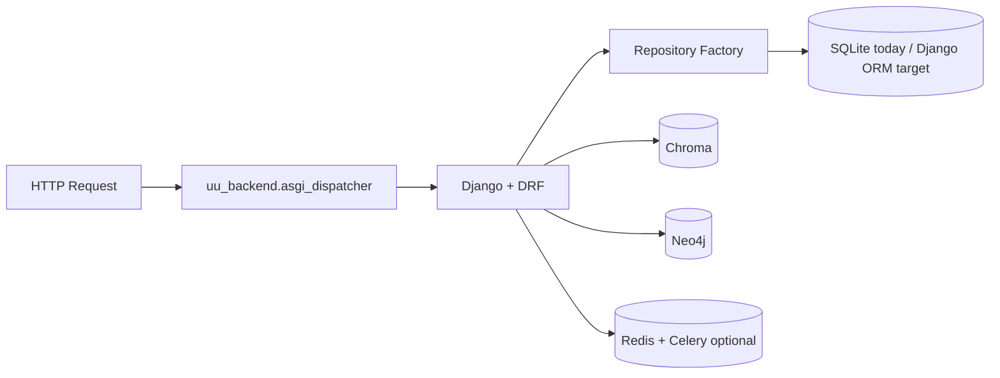

# Unstructured Unlocked - Backend

The backend API for Unstructured Unlocked, a document intelligence system for temporal analysis.

## Current Runtime Architecture



- Dispatcher entrypoint: `uu_backend.asgi_dispatcher:application`
- SQL backend control: `DATA_BACKEND` (`sqlite`, `dual`, `django`)
- Async control: `ASYNC_EXECUTOR` (`inline`, `celery`)

## Quick Start

### Prerequisites

- Python 3.12+
- [UV](https://docs.astral.sh/uv/) (fast Python package manager)

### Installation

```bash
cd backend

# Install UV if you haven't already
# Windows:
powershell -ExecutionPolicy ByPass -c "irm https://astral.sh/uv/install.ps1 | iex"

# macOS/Linux:
curl -LsSf https://astral.sh/uv/install.sh | sh

# Install dependencies
uv sync
```

### Running Locally

```bash
# Run the development server
uv run uvicorn uu_backend.asgi_dispatcher:application --reload --port 8000
```

### Running with Docker

```bash
# From the project root
docker-compose up --build
```

## API Endpoints

| Endpoint | Method | Description |
|----------|--------|-------------|
| `/health` | GET | Health check and service status |
| `/api/v1/ingest` | POST | Upload and process documents |
| `/api/v1/ingest/status` | GET | Get ingestion statistics |
| `/api/v1/timeline` | GET | Get documents grouped by date |
| `/api/v1/timeline/range` | GET | Get date range of all documents |
| `/api/v1/documents` | GET | List all documents |
| `/api/v1/documents/{id}` | GET | Get a specific document |
| `/api/v1/documents/{id}` | DELETE | Delete a document |

## API Documentation

Once running, visit:
- API docs (Django / drf-spectacular): http://localhost:8000/docs
- ReDoc: http://localhost:8000/redoc
- OpenAPI schema: http://localhost:8000/api/schema/

## Project Structure

```
backend/
├── src/uu_backend/
│   ├── asgi_dispatcher.py    # Composite ASGI routing
│   ├── django_project/       # Django settings/asgi/wsgi
│   ├── django_api/           # Django DRF route groups
│   ├── repositories/         # DATA_BACKEND abstraction
│   ├── database/             # SQLite/Chroma/Neo4j clients
│   ├── ingestion/
│   ├── services/
│   ├── tasks/                # Celery tasks
│   ├── models/
│   └── config.py
├── pyproject.toml            # Project configuration
└── Dockerfile
```

## Environment Variables

| Variable | Default | Description |
|----------|---------|-------------|
| `API_HOST` | `0.0.0.0` | API bind host |
| `API_PORT` | `8000` | API port |
| `DEBUG` | `false` | Enable debug mode |
| `CHROMA_PERSIST_DIRECTORY` | `./data/chroma` | ChromaDB storage path |
| `CHUNK_SIZE` | `1000` | Characters per chunk |
| `CHUNK_OVERLAP` | `200` | Overlap between chunks |
| `CORS_ORIGINS` | `["http://localhost:3000"]` | Allowed CORS origins |
| `DATA_BACKEND` | `sqlite` | Persistence backend mode (`sqlite`, `dual`, `django`) |
| `ASYNC_EXECUTOR` | `inline` | Background executor (`inline`, `celery`) |

## Migration Utilities

```bash
# Regenerate endpoint inventory and docs
python scripts/generate_endpoint_inventory.py

# Run smoke checks against a running backend (default localhost:8000)
./scripts/smoke_frontend_flows.sh

# Apply Django migrations (ORM parity tables)
PYTHONPATH=src uv run python manage.py migrate

# Import legacy SQLite data into Django ORM tables
PYTHONPATH=src uv run python manage.py import_sqlite --tables all

# Validate row-count parity between SQLite and Django ORM
PYTHONPATH=src uv run python manage.py validate_sql_parity
```

## Development

```bash
# Install dev dependencies
uv sync --all-extras

# Run tests
uv run pytest

# Format code
uv run ruff format .

# Lint code
uv run ruff check .
```
