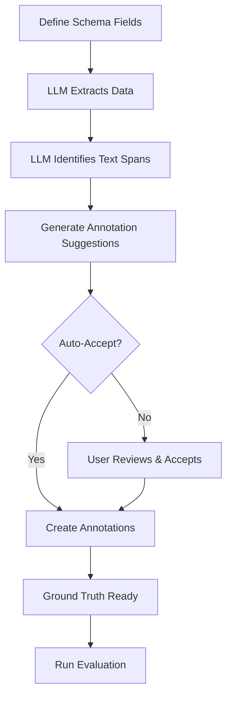

# Schema-Based Labeling with AI Suggestions

## Overview

The schema-based labeling workflow uses your document type's schema fields to automatically suggest annotations using OpenAI's structured output. This dramatically speeds up the labeling process for creating ground truth data.

## How It Works



## Benefits

✅ **No manual label creation** - Labels are auto-created from schema fields  
✅ **Precise text spans** - LLM identifies exact character positions  
✅ **Structured extraction** - Uses Pydantic models for type safety  
✅ **Fast labeling** - Auto-accept for quick ground truth creation  
✅ **Works with tables** - Handles array-of-objects fields  

## Workflow

### 1. Define Your Schema

Create a document type with schema fields (you already have this!):

```json
{
  "name": "Claim Form",
  "schema_fields": [
    {
      "name": "claim_number",
      "type": "string",
      "description": "The claim reference number"
    },
    {
      "name": "claim_items",
      "type": "array",
      "items": {
        "type": "object",
        "properties": {
          "item_name": {"type": "string"},
          "item_description": {"type": "string"},
          "item_cost": {"type": "number"}
        }
      }
    }
  ]
}
```

### 2. Classify Your Document

```powershell
POST /api/v1/taxonomy/documents/{document_id}/classify
{
  "document_type_id": "your-claim-form-type-id"
}
```

### 3. Get AI-Suggested Annotations

**Option A: Preview suggestions (review before accepting)**

```powershell
$response = Invoke-RestMethod `
  -Uri "http://localhost:8000/api/v1/annotations/documents/{document_id}/suggest-annotations" `
  -Method POST

# Response includes:
# - suggestions: Array of annotation suggestions with text spans
# - extraction_preview: What would be extracted
```

**Option B: Auto-accept (fast ground truth creation)**

```powershell
$response = Invoke-RestMethod `
  -Uri "http://localhost:8000/api/v1/annotations/documents/{document_id}/suggest-annotations?auto_accept=true" `
  -Method POST

# Annotations are automatically created!
```

### 4. Review Annotations (Optional)

```powershell
GET /api/v1/annotations/documents/{document_id}/annotations
```

View in the UI to verify or make corrections.

### 5. Run Evaluation

Now that you have ground truth annotations, evaluate your extraction:

```powershell
POST /api/v1/evaluation/run
{
  "document_id": "{document_id}",
  "use_structured_output": true
}
```

## API Endpoints

### Suggest Annotations

```
POST /api/v1/annotations/documents/{document_id}/suggest-annotations
```

**Query Parameters:**
- `auto_accept` (bool, default: false) - Automatically create annotations

**Response:**
```json
{
  "document_id": "...",
  "document_type_id": "...",
  "suggestions": [
    {
      "field_name": "claim_number",
      "label_name": "claim_number",
      "spans": [
        {
          "text": "CLM-2024-001",
          "start_char": 45,
          "end_char": 57
        }
      ],
      "confidence": 0.9,
      "reasoning": "Extracted value: CLM-2024-001"
    },
    {
      "field_name": "claim_items",
      "label_name": "claim_items_item_name",
      "spans": [
        {
          "text": "Laptop Repair",
          "start_char": 120,
          "end_char": 133
        },
        {
          "text": "Monitor",
          "start_char": 180,
          "end_char": 187
        }
      ],
      "confidence": 0.85,
      "reasoning": "Found 2 instances of item_name"
    }
  ],
  "extraction_preview": {
    "claim_number": "CLM-2024-001",
    "claim_items": [
      {
        "item_name": "Laptop Repair",
        "item_description": "Screen replacement",
        "item_cost": 450.00
      },
      {
        "item_name": "Monitor",
        "item_description": "24-inch display",
        "item_cost": 200.00
      }
    ]
  }
}
```

## Comparison: Old vs New Workflow

### Old Workflow (Annotation-Based)
1. Create labels manually
2. Annotate document manually (or use ML suggestions)
3. Extract from annotations
4. Evaluate

**Time:** ~10-15 minutes per document

### New Workflow (Schema-Based)
1. Define schema once
2. Run `suggest-annotations?auto_accept=true`
3. Evaluate

**Time:** ~30 seconds per document

## Use Cases

### Fast Ground Truth Creation
```powershell
# Process 10 documents quickly
$documents = @("doc1", "doc2", "doc3", ...)
foreach ($doc in $documents) {
    Invoke-RestMethod `
      -Uri "http://localhost:8000/api/v1/annotations/documents/$doc/suggest-annotations?auto_accept=true" `
      -Method POST
}
```

### Quality Review Workflow
```powershell
# Get suggestions first
$suggestions = Invoke-RestMethod `
  -Uri "http://localhost:8000/api/v1/annotations/documents/{doc_id}/suggest-annotations" `
  -Method POST

# Review in UI, then accept manually or via API
```

### Hybrid Approach
```powershell
# Auto-accept for simple fields, manual review for complex ones
$response = Invoke-RestMethod `
  -Uri "http://localhost:8000/api/v1/annotations/documents/{doc_id}/suggest-annotations?auto_accept=true" `
  -Method POST

# Then manually correct any errors in the UI
```

## Tips

1. **Start with auto-accept** for quick iteration, then spot-check a few documents
2. **Use structured extraction** (`use_structured_output=true`) for evaluation to match the suggestion approach
3. **Define good descriptions** in your schema fields - the LLM uses these to understand what to extract
4. **For tables**, the system automatically creates labels like `field_name_property_name` (e.g., `claim_items_item_cost`)

## Troubleshooting

**No suggestions returned:**
- Ensure document is classified
- Verify schema fields are defined
- Check that labels exist (they should be auto-created from schema)

**Incorrect text spans:**
- The LLM does its best to identify positions, but may not be perfect
- Review and correct in the UI if needed
- Consider this as a starting point, not perfect ground truth

**Missing fields:**
- If the LLM can't find a field value, it won't create a suggestion
- This is expected behavior - not all documents have all fields

## Next Steps

1. Try it with your claim form document
2. Compare evaluation results: annotation-based vs structured output
3. Build a pipeline to process batches of documents
4. Use the ground truth to train/improve your extraction prompts
