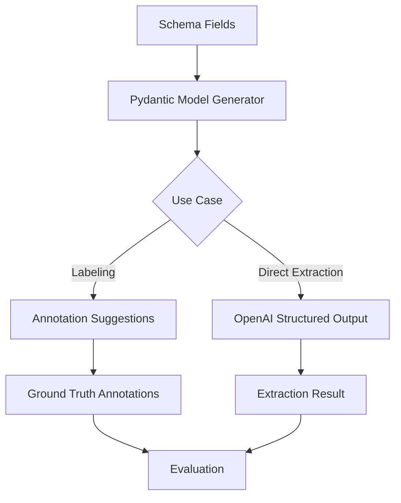

# Structured Output Implementation Summary

## What Changed

You now have **two powerful ways** to use your schema fields:

### 1. Direct Structured Extraction (No Annotations Needed)
- **File**: `backend/src/uu_backend/services/schema_generator.py`
- **Purpose**: Converts schema fields → Pydantic models → OpenAI structured output
- **Benefit**: Extract data directly without needing to create annotations first

### 2. Schema-Based Annotation Suggestions (Fast Labeling)
- **File**: `backend/src/uu_backend/services/schema_based_suggestion_service.py`
- **Purpose**: Uses schema to suggest annotations with exact text spans
- **Benefit**: Rapidly create ground truth for evaluation

## Architecture



## Key Files Created/Modified

### New Files
1. `backend/src/uu_backend/services/schema_generator.py`
   - `generate_pydantic_schema()` - Converts SchemaField → Pydantic model
   - `schema_to_json_schema()` - For OpenAI API
   - Handles nested objects and arrays

2. `backend/src/uu_backend/services/schema_based_suggestion_service.py`
   - `suggest_annotations()` - LLM suggests annotations from schema
   - Returns text spans with character positions
   - Auto-accept option for fast ground truth creation

3. `docs/SCHEMA_BASED_LABELING.md` - Complete guide
4. `docs/STRUCTURED_OUTPUT_SUMMARY.md` - This file

### Modified Files
1. `backend/src/uu_backend/services/extraction_service.py`
   - Added `extract_structured()` method
   - Uses Pydantic schema for type-safe extraction

2. `backend/src/uu_backend/services/evaluation_service.py`
   - Added `use_structured_output` parameter
   - Can evaluate both annotation-based and direct extraction

3. `backend/src/uu_backend/api/routes/taxonomy.py`
   - Added `use_structured_output` query param to extract endpoint

4. `backend/src/uu_backend/api/routes/annotations.py`
   - Added `/documents/{id}/suggest-annotations` endpoint

5. `backend/src/uu_backend/api/routes/evaluation.py`
   - Added `use_structured_output` to evaluation requests

6. `backend/src/uu_backend/models/evaluation.py`
   - Added `use_structured_output` field to request model

## API Endpoints

### Direct Extraction
```
POST /api/v1/taxonomy/documents/{document_id}/extract?use_structured_output=true
```

### Annotation Suggestions
```
POST /api/v1/documents/{document_id}/suggest-annotations?auto_accept=true
```

### Evaluation with Structured Output
```
POST /api/v1/evaluation/run
{
  "document_id": "...",
  "use_structured_output": true
}
```

## Workflow Comparison

### Traditional Workflow
```
1. Define schema
2. Create labels manually
3. Annotate documents manually
4. Extract from annotations
5. Evaluate
```
**Time**: ~15 min/document

### New Workflow (Fast)
```
1. Define schema (once)
2. Classify document
3. POST /suggest-annotations?auto_accept=true
4. POST /evaluation/run with use_structured_output=true
```
**Time**: ~30 sec/document

### New Workflow (Quality)
```
1. Define schema (once)
2. Classify document
3. POST /suggest-annotations (review suggestions)
4. Accept/correct in UI
5. POST /evaluation/run with use_structured_output=true
```
**Time**: ~2-3 min/document

## Benefits

✅ **Type Safety** - Pydantic models enforce schema structure
✅ **No Manual Labels** - Auto-created from schema fields
✅ **Faster Labeling** - AI suggests annotations with exact positions
✅ **Better for Tables** - Native support for array-of-objects
✅ **Backward Compatible** - Old annotation-based workflow still works
✅ **Evaluation Ready** - Structured output can be evaluated against ground truth

## Example: Claim Form

### Your Schema
```json
{
  "name": "Claim Form",
  "schema_fields": [
    {
      "name": "claim_items",
      "type": "array",
      "items": {
        "type": "object",
        "properties": {
          "item_name": {"type": "string"},
          "item_description": {"type": "string"},
          "item_cost": {"type": "number"}
        }
      }
    }
  ]
}
```

### Generated Pydantic Model
```python
class ClaimItemsObject(BaseModel):
    item_name: str
    item_description: str
    item_cost: float

class ClaimFormExtraction(BaseModel):
    claim_items: list[ClaimItemsObject]
```

### OpenAI Response (Enforced Structure)
```json
{
  "claim_items": [
    {
      "item_name": "Laptop Repair",
      "item_description": "Screen replacement",
      "item_cost": 450.00
    },
    {
      "item_name": "Monitor",
      "item_description": "24-inch display",
      "item_cost": 200.00
    }
  ]
}
```

### Auto-Created Labels
- `claim_items_item_name`
- `claim_items_item_description`
- `claim_items_item_cost`

## Next Steps

1. **Classify your document** (if not already done)
   ```powershell
   POST /api/v1/taxonomy/documents/{id}/classify
   {
     "document_type_id": "your-claim-form-type-id"
   }
   ```

2. **Get annotation suggestions**
   ```powershell
   POST /api/v1/documents/{id}/suggest-annotations?auto_accept=true
   ```

3. **Run evaluation**
   ```powershell
   POST /api/v1/evaluation/run
   {
     "document_id": "{id}",
     "use_structured_output": true
   }
   ```

4. **Compare approaches**
   - Run evaluation with `use_structured_output=false` (annotation-based)
   - Run evaluation with `use_structured_output=true` (direct extraction)
   - Compare F1 scores, precision, recall

## Technical Details

### Pydantic Schema Generation
- Recursively converts `SchemaField` to Python type annotations
- Handles nested objects by creating sub-models
- Supports arrays with `list[ItemType]` syntax
- Uses `Field()` for descriptions and validation

### OpenAI Structured Output
- Requires `gpt-4o-2024-08-06` or later
- Uses `response_format` with JSON schema
- Enforces exact structure - no hallucination
- Returns parsed Pydantic model instance

### Annotation Suggestions
- Two-phase LLM call:
  1. Extract structured data
  2. Identify text spans for each value
- Returns character positions (0-indexed)
- Auto-accept creates annotations immediately

## Limitations

1. **Text span accuracy** - LLM does its best but may not be perfect
2. **Token limits** - Documents truncated to ~8000 chars
3. **Model requirement** - Structured output needs `gpt-4o-2024-08-06`
4. **Cost** - Two LLM calls for annotation suggestions (one for extraction, one for spans)

## Future Enhancements

- [ ] Batch processing for multiple documents
- [ ] Confidence thresholds for auto-accept
- [ ] User feedback loop for improving suggestions
- [ ] Frontend UI for reviewing suggestions
- [ ] Caching of extraction results
- [ ] Support for other LLM providers (Claude, etc.)
